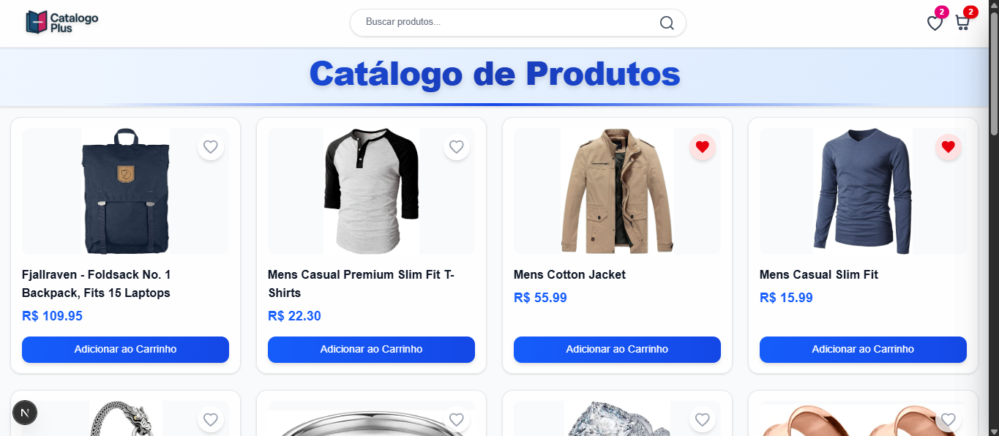
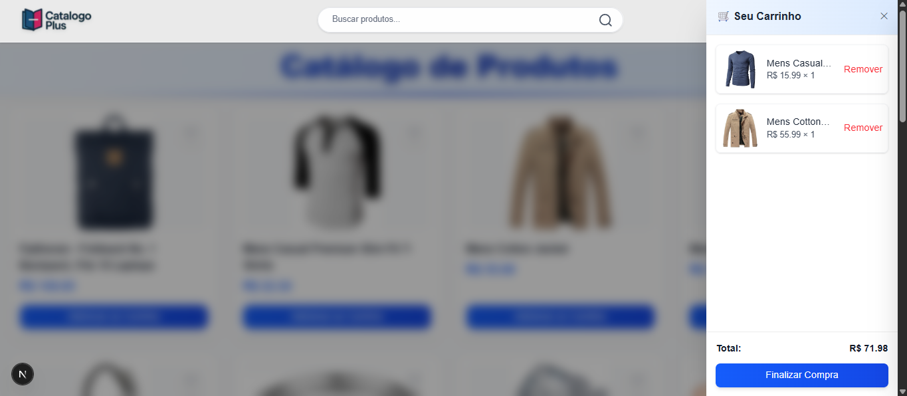
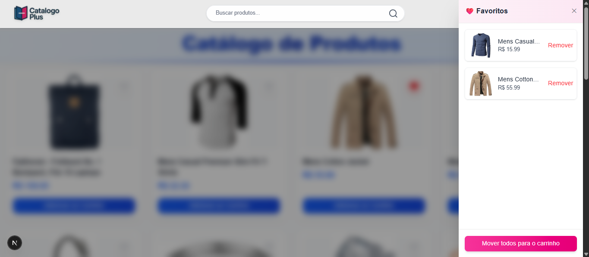

# CatálogoPlus


Uma aplicação web moderna para exibição de produtos com carrinho e favoritos, desenvolvida em **Next.js** + **TailwindCSS**.  
O objetivo é oferecer uma experiência de catálogo simples, responsiva e com UX fluida.

---

## Funcionalidades

- 🔍 **Busca de produtos** em tempo real  
- ❤️ **Favoritos** (adicionar/remover)  
- 🛒 **Carrinho de compras** com cálculo automático do total  
- 📱 **Layout responsivo**  
- 🎨 **Design moderno** com TailwindCSS + animações  
- 🖼️ **Exibição de imagens dos produtos** 
- 📑 **Separação de lógica e apresentação** para facilitar manutenção  

---

## Tecnologias

- [Next.js](https://nextjs.org/)  
- [React](https://react.dev/)  
- [Tailwind CSS](https://tailwindcss.com/)  
- [Framer Motion](https://www.framer.com/motion/)  

---

## Estrutura de Pastas

```bash
.
├── components/        # Componentes reutilizáveis (Header, Cart, Favorites, etc)
├── hook/              # Hooks customizados (ex: useCatalog)
├── pages/             # Páginas da aplicação
├── public/            # Imagens estáticas (Logo, ícones, etc)
├── styles/            # Estilos globais (Tailwind e customizações)
└── README.md          # Documentação do projeto
```
---

## Como rodar o projeto

**1° Clone o repositório:**

```
git clone https://github.com/seu-usuario/catalogoplus.git
```

**2° Entre na pasta:**
```
cd catalogoplus
```

**3° Instale as dependências:**
```
npm install
```

**4° Rode o servidor de desenvolvimento:**
```
npm run dev
```

**5° Abra em:**
```
http://localhost:3000
```

---

## Deploy
O projeto está disponível em produção na Vercel:

👉 [Demo Online](https://catalogo-plus.vercel.app/)

---

## Prévia

### Tela inicial


### Carrinho


### Favoritos


## Contribuição
Contribuições são bem-vindas! Se você encontrar bugs, tiver sugestões ou melhorias, fique à vontade para abrir uma issue ou enviar um pull request.
